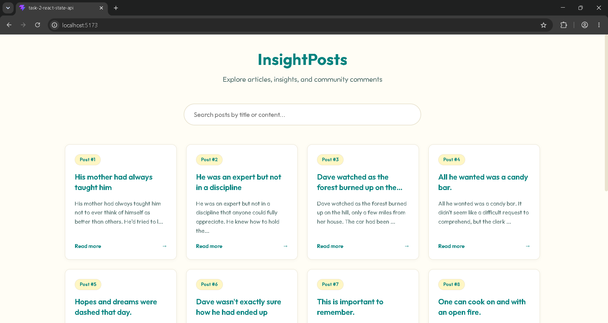
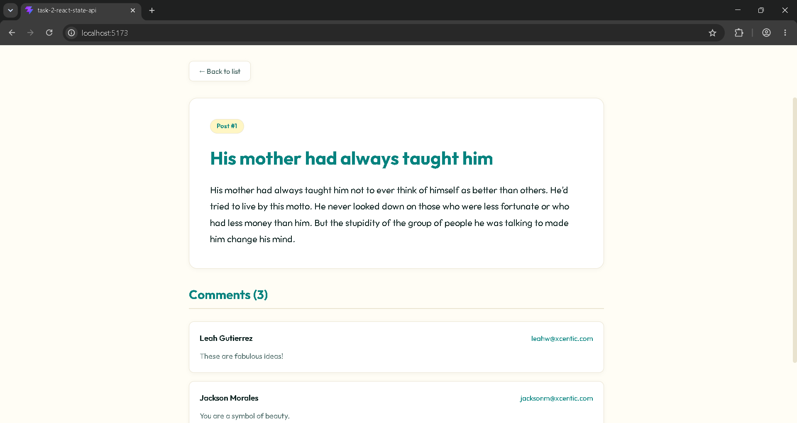

# React UI with State Management & API Integration

This is a simple React application that fetches posts and articles from the DummyJSON API and displays them in a clean layout. This supports Search with Debounce, Pagination, Details without using component libraries (no MUI, shadcn, etc.).

---

## Tech Stack
- **Frontend**: React (with Vite)
- **Styling**: Vanilla CSS

---

## Logics I Used

### Debounce Logic (How search works)
If the app searched the list every time you typed a single letter, it would run the search code too many times and make the page laggy. 

So, I wrote a custom hook called `useDebounce`:
1. When you type a letter, a timer starts (set to 300 milliseconds).
2. If you type another letter before 300ms is over, the old timer is cleared and a new 300ms timer starts.
3. Once you stop typing for a full 300ms, the app finally updates the search results.
This keeps the page smooth and fast!

---

## Public API Used

### 1. Get Posts
- **Endpoint**: `https://dummyjson.com/posts?limit=100`
- **What it returns (JSON structure)**:
```json
{
  "posts": [
    {
      "id": 1,
      "title": "His mother had always taught him",
      "body": "His mother had always taught him not to ever think of himself as better than others...",
      "tags": ["history", "american", "crime"],
      "reactions": {
        "likes": 192,
        "dislikes": 25
      },
      "views": 305,
      "userId": 121
    }
  ],
  "total": 251,
  "skip": 0,
  "limit": 100
}
```

### 2. Get Post Details
- **Endpoint**: `https://dummyjson.com/posts/{id}`
- **What it returns (JSON structure)**:
```json
{
  "id": 1,
  "title": "His mother had always taught him",
  "body": "His mother had always taught him not to ever think of himself as better than others...",
  "tags": ["history", "american", "crime"],
  "reactions": {
    "likes": 192,
    "dislikes": 25
  },
  "views": 305,
  "userId": 121
}
```

### 3. Get Post Comments
- **Endpoint**: `https://dummyjson.com/comments/post/{id}`
- **What it returns (JSON structure)**:
```json
{
  "comments": [
    {
      "id": 93,
      "body": "These are fabulous ideas!",
      "postId": 1,
      "likes": 7,
      "user": {
        "id": 190,
        "username": "leahw",
        "fullName": "Leah Gutierrez"
      }
    }
  ],
  "total": 3,
  "skip": 0,
  "limit": 3
}
```

---

## Setup and Running Instructions

1. Install dependencies:
   ```bash
   npm install
   ```

2. Start the development server:
   ```bash
   npm run dev
   ```

---

## UI Screenshots

### Post List View


### Post Details and Comments View

